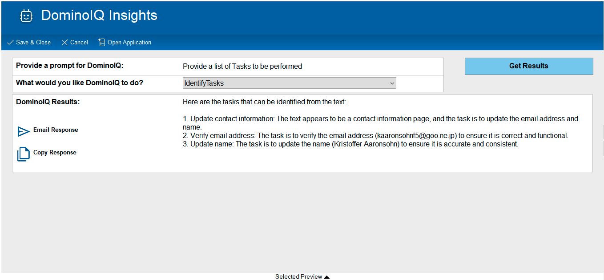

# DominoIQ Insights

## Info
Property | Value   
---|---
Filename | domiq_insights.ntf
Templatename | DomIQInsights_V1
Template version | 1.0.0 (July 3, 2025)
Signed by | Domino Template Development/Domino
Optimized for | Notes Client

### ** This template is not intended for Web (browser) or HCL Nomad use.

## What does this Domino application do?
The DominoIQ Insights application is designed to assist customers who want to use the DominoIQ AI Engine that is included in Domino V14.5+, but do not have Domino Designers to augment their existing Domino applications. 

The DominoIQ applicaiton can assist in adding DominoIQ functionality into ANY of your existing Domino applications quickly and by anyone with Designer ACL Access to the Domino application.

## Who will use this Domino application?
The DominoIQ Insights application is intended fopr use by two types of people:

<b>Domino Administrators/Designers:</b> These users can use the applicaiton to enable DominoIQ functionality into ANY existing Domino application. By creating a Configuration document for an existing Domino application, the Administrator/Designer can select which Form(s) and which Field(s) on the Form(s) can be exposed to the DominoIQ engine.

<b>Notes Client Users:</b> End users can use the DominoIQ functionality inside the enabled Domino applications by acessing the "DominoIQ Insights" functionality found wihtin the "Actions" menu. This will launch a Wizard interface inside the DominoIQ Insights appliction where they can provide Prompts to DominoIQ and receive the AI Results on screen. these Results can then be saved for future reference, copied onto the user's clipboard for use elsewhere, emailed to other recipients, and shared between co-workers. 

## Access Control
The Access Control List level should be Author for all <b>End Users</b> of this application.  This will prevent unauthorized editing of documents within the application. The Author fields within the forms govern who will be able to edit/review particular documents. Errors may occur if someone with Editor access attempts to review a Document when they are not an authorized viewer of that Document.

The Access Control List level for <b>Administrators/Developers</b> needs to be at least <b>"Designer"</b> with the <b>"Admin"</b> Role assigned to them. Without the Role, the users will not be able to configure the DominoIQ Insights application. 

## Important Note
The DominoIQ Insights template should only be used to create new applications. Upgrading existing Document Library applications with this template is not supported.

## Issues
For issues please use the [GitHub issue tracker](issues)

## Contributing
We welcome contributions following [our guidelines](CONTRIBUTING.md).

## License
The files in this repository are licensed under the [Apache License 2.0](https://www.apache.org/licenses/LICENSE-2.0.html). 
